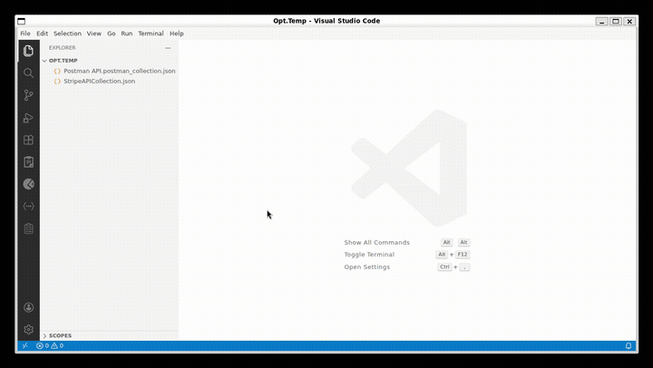

  

# APIxs (API Client with extra scripting)

> REST & HTTP client built directly into VS Code. Designed for local-first workflows and seamless automation.

APIxs is a robust REST & HTTP client built directly into VS Code. It provides the power of professional tools like Postman, Bruno, and Thunder Client while remaining lightweight and strictly local-first. With a built-in collection runner and full `pm-scripting` compatibility, APIxs is the perfect tool for developers who value privacy, speed, and version control.

---

## Why I Built This

I was tired of the direction API clients were heading. Postman pushed everyone to the cloud, added mandatory logins, and started gating features behind paid tiers. My team's collections had hundreds of requests with complex pre-request scripts, chained auth flows, and environment-specific configs. One day, Postman's sync broke mid-sprint and we lost 2 hours debugging whether the bug was in our API or in stale cached requests.

I tried alternatives. Thunder Client was fast but couldn't run my `pm.sendRequest` chains or `setNextRequest` flows. Bruno was promising but didn't fit our scripting patterns. I needed something that:

- **Import my Postman collections and just go** — the format is public, the workflow should feel identical
- **Runs my existing Postman scripts** without rewriting anything
- **Lives in my editor** so I stop context-switching
- **Stores everything as plain files** so my collections go through PR review like any other code
- **Works offline, forever** with no account, no cloud, no telemetry
- **No collection run limits** — run locally as much as you want, no artificial caps

So I built APIxs. It started as a weekend hack and turned into the tool my team actually ships with.

## Why APIxs?

- **Universal Compatibility**: Fully compatible with **VSCodium** and other VS Code-based IDEs like **Cursor**, **Windsurf**, and **Antigravity**. Published to the **[Open VSX Registry](https://open-vsx.org/extension/abridge/apixs)** for the broadest accessibility.
- **Intuitive Familiarity**: If you've used Postman or Bruno, you'll feel right at home. APIxs follows industry-standard UX patterns and scripting conventions, making the transition seamless.
- **100% Local**: Your data never leaves your machine unless you push it to your own git repository.
- **Git-Friendly Storage**: Collections are stored as individual JSON files. No binary blobs, no proprietary databases — just clean files that are easy to diff and merge.
- **No Cloud Bloat**: Fast startup, zero-latency UI, and no account required.

---

## Key Features

### 🚀 Advanced Scripting & Test Automation
Migrate your complex workflows without rewriting your scripts. APIxs supports the industry-standard `pm.*` API for pre-request and test scripts.
- **Postman-Compatible**: Supports `pm.environment`, `pm.test`, `pm.expect`, and more.
- **Async Execution**: Use `pm.sendRequest()` for multi-step auth or data fetching.
- **Pre-loaded Libraries**: Access `lodash`, `moment`, `crypto`, `yaml`, and `uuid` out of the box.
- **Snippet Bar**: Fuzzy-searchable bottom bar with 70+ `pm.*` snippets — type `pm test status` and insert instantly.

### 🏃 Power Tools: Collection Runner
Automate your API testing with the high-performance Folder Runner—a feature often missing from other VS Code clients.
- **Bulk Execution**: Run entire folders or collections sequentially.
- **Data-Driven Runs**: Iterate over CSV or JSON files; last 10 files remembered per workspace for one-click reload.
- **Customizable Logic**: Configure iterations, delays, and "Stop on Error" behavior.
- **Integrated Reports**: View real-time success/failure metrics, including pre/post script assertion results.

### 🧪 Smart Variable Engine
Powerful template resolution across URLs, headers, and bodies with a clear resolution hierarchy:
1. **Local Variables**: Specific to the current execution scope.
2. **Collection Variables**: Shared across all requests in a collection.
3. **Environment Profiles**: Switch between Dev, Staging, and Prod with one click.
4. **.env Support**: Automatically picks up variables from your workspace `.env` files.
5. **OS Environment**: Injects system variables using the `{{$env.VAR}}` syntax.
6. **Dynamic Generators**: 100+ faker-powered variables like `{{$guid}}`, `{{$timestamp}}`, and `{{$randomEmail}}`.

### 🔍 Deep Inspection & cURL
Understand exactly what's happening under the hood.
- **Request/Response Dump**: View the raw HTTP payload exactly as it travels over the wire — even for failed requests, with fully resolved variables.
- **Instant cURL**: Copy any request as a standard cURL command with one click. Or go the other way — **Paste from cURL** on any folder to create a request from your clipboard.
- **Performance Metrics**: Detailed timing breakdown (DNS, TCP, TLS, First Byte) for every call.
- **Log Level Filter**: Native VS Code Output panel with Info / Warning / Error / Debug filter dropdown — `console.log` from scripts is now searchable.

### 🎨 Response Viewer
- **JSON**: Pretty-printed with syntax highlighting and optional alphabetical key sort.
- **Images**: Render PNG/JPEG/WebP/SVG responses inline.
- **PDF**: One click opens the response in your OS's PDF viewer.
- **XML, HTML, Text**: Auto-detected formatting.

### 📦 Import & Export
- **Import** Postman v2.1 collections and environments.
- **Import from cURL** — paste a cURL command to create a request (right-click any folder).
- **Export to Postman** — round-trip your collections back to Postman v2.1 format for Newman or team sharing.

---

## Installation

### For Open VSX-native IDEs (VSCodium, Windsurf, etc.)
Search for **APIxs** in the Extensions view and click **Install**.

### For VS Code
Since APIxs is hosted on Open VSX, VS Code users can install it by downloading the package:
1. Visit the **[APIxs page on Open VSX](https://open-vsx.org/extension/abridge/apixs)**.
2. Click the **Download** button to get the `.vsix` file.
3. In VS Code, open the Extensions view, click the **...** (More Actions) menu, and select **Install from VSIX...**

---

## Getting Started

1. Click the **APIxs icon** in the Activity Bar.
2. Create a **New Collection** or **Import** an existing collection.
3. Configure your **Environments** in the sidebar.
4. Start sending requests!

### 📥 Seamless Migration
Import your existing collection. APIxs automatically supports formats from other popular tools:
- Import Postman `.json` collection files (v2.1).
- **Paste from cURL**: right-click any folder → *Paste from cURL* to create a request from your clipboard.
- Automatically migrate request metadata, headers, and body.
- Support for Bearer, Basic, and API Key authentication.
- Preserve pre-request and test scripts.
- Retain variables and folder structures.
- **Round-trip**: Export back to Postman v2.1 format at any time.

---

## Command Palette

Open the Command Palette (`Ctrl+Shift+P` / `Cmd+Shift+P`) and type **Apixs** to access:

| Command                                | Description                                  |
| -------------------------------------- | -------------------------------------------- |
| `Apixs: Open Apixs`                    | Open the main APIxs panel                    |
| `Apixs: SSE Viewer`                    | Open the Server-Sent Events streaming viewer |
| `Apixs: Import Collection/Environment` | Import a collection or environment file      |
| `Apixs: Switch Environment`            | Switch the active environment                |

---

## SSE Streaming

APIxs includes a built-in **Server-Sent Events (SSE) viewer** for real-time streaming endpoints. Launch it from the Command Palette with `Apixs: SSE Viewer`.

- **Connect** to any SSE endpoint and watch events stream in real-time
- **Auth support**: Bearer token, Basic auth, and API Key (header or query param)
- **Auto-scroll** to follow incoming events as they arrive
- **Pretty-print** JSON event payloads automatically
- **Variable substitution** in URL and auth fields using `{{variables}}`

---

## Keybindings

| Command                | Keybinding     |
| ---------------------- | -------------- |
| **Send Request**       | `Ctrl + Enter` |
| **Save Request**       | `Ctrl + S`     |
| **Switch Environment** | `Ctrl + E`     |

---

## Settings

| Setting                 | Description                                 | Default |
| ----------------------- | ------------------------------------------- | ------- |
| `apixs.defaultTimeout`  | Request timeout in milliseconds             | `30000` |
| `apixs.sslVerification` | Enable/Disable SSL certificate verification | `true`  |
| `apixs.proxy`           | HTTP proxy URL (e.g., `http://proxy:8080`)  | `""`    |

---

License: Proprietary | Created by abridge
